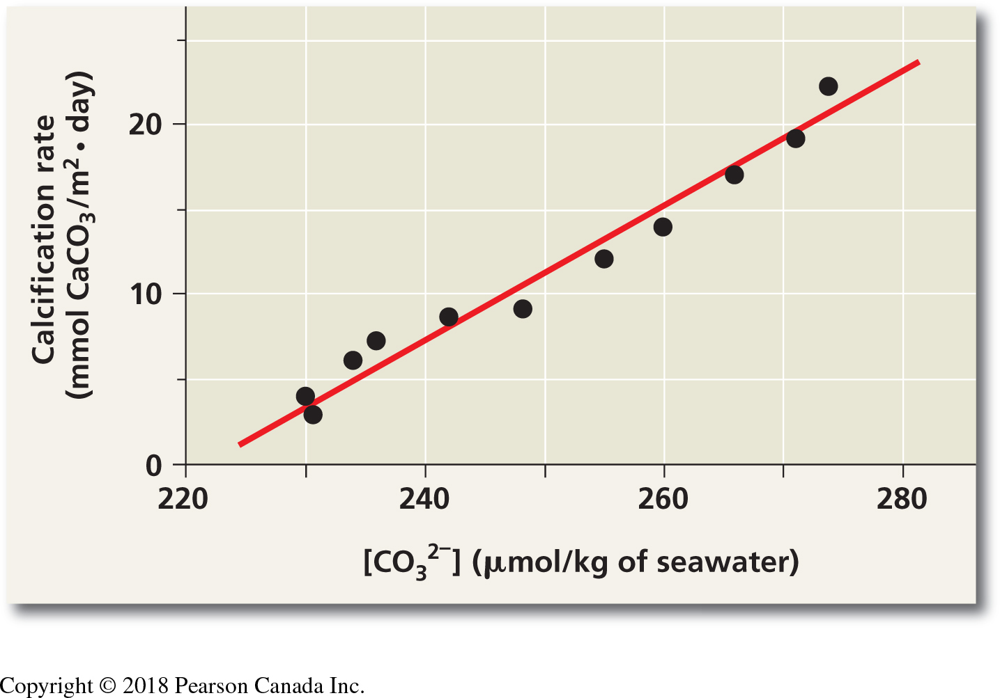
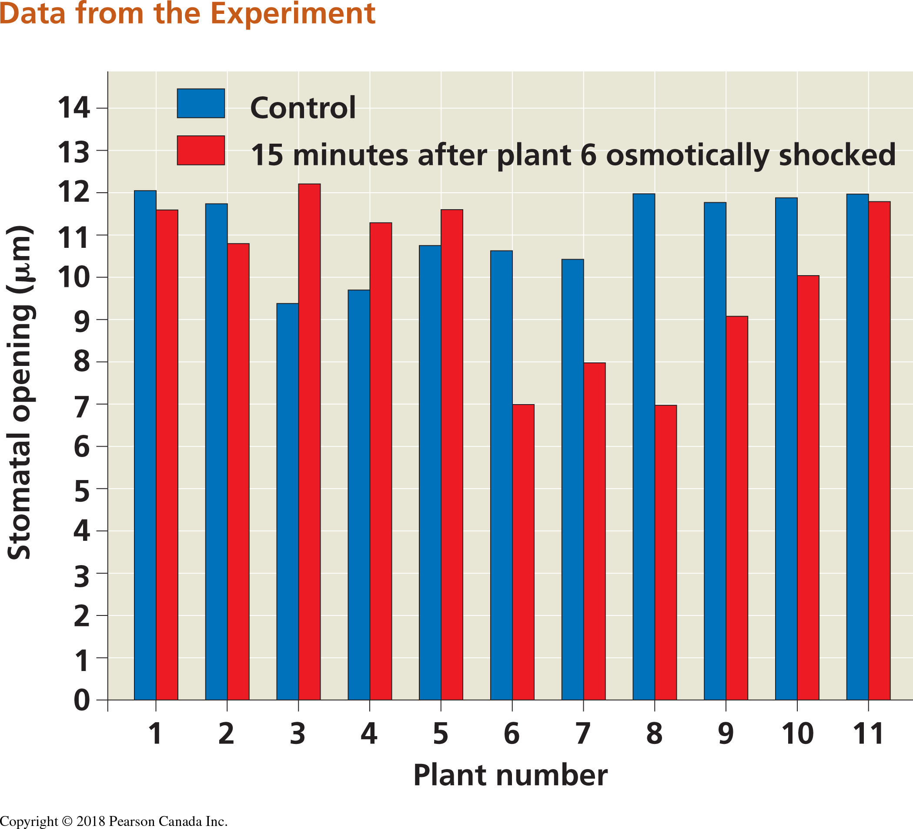

--- 
title: "BIOL 1001 - Quantitative skills"
site: bookdown::bookdown_site
output: bookdown::gitbook #bookdown::html_document2
documentclass: book
bibliography: [references.bib]
biblio-style: apalike
link-citations: false 
github-repo: ahurford/
---

# Learning to use R and RStudio

We are increasing the focus on quantitative skills in our Biology curriculum, in response to changing demands and emphasis within the field of biology itself. In first year biology (BIOL 1001/1002) we are introducing students to R software and basic statistical concepts.

The [quantitative training guide](https://ahurford.github.io/quant-guide-all-courses/) has been writing to teach MUN biology students R coding to build a foundation for more advanced quantitative analysis of data in upper year Biology courses. We anticipate that this guide will also be a useful resource manual that you will refer back to as you use R in your future courses.

1. Read [Introduction](https://ahurford.github.io/quant-guide-all-courses/). As you read through the next sections, if you encounter a word you do not understand you may wish to consult the [Glossary](https://ahurford.github.io/quant-guide-all-courses/glossary.html).

2. Follow the steps in [R and RStudio](https://ahurford.github.io/quant-guide-all-courses/install.html) to install R and RStudio. If you are having issues with installing the software, check the [Frequently Asked Questions]([https://ahurford.github.io/quant-guide-all-courses/faq.html).

3. Read [Finding your way around RStudio](https://ahurford.github.io/quant-guide-all-courses/rstudio.html). Have your RStudio software open.

 - When you encounter **TRY IT!** or Courier font text in a grey box, this is an example of code that we want you to try in RStudio. Note that you should type the code exactly as it is written.
 
 - When you encounter EXERCISE or **HAND IN** this is a question that your laboratory instructor may ask you to complete and hand in.
 
 - You may wish to re-size the windows on your computer to view both the quantitative training guide and the RStudio software, or you may wish to view the training guide on a tablet, with the software open on your computer.

4. Work through [Introduction to R](https://ahurford.github.io/quant-guide-all-courses/rintro.html). We will sometimes give you only part of the code, or we will give code that has a deliberate mistake in it. This is not to frustrate you - rather it is a way for you to start to develop your problem solving skills. Read the text before and after the example code carefully for clues as to what you should do.

5. Proceed through the sections as assigned by your lab instructor. 

Expect to get stuck. This is normal when learning a new skill. Everyone who uses R, including professionals who have used it for years, gets error messages and have bugs in their code. You might look for help in [Getting help](https://ahurford.github.io/quant-guide-all-courses/help.html) or ask for help from an instructor as specified in section \@ref(howtoask).

Once you've finished the first-year labs, don't forget that you have this resource. Whenever you practice using R you will get better at it. If you haven't used it for a while, your skills get rusty, but by reviewing the relevant sections of the [quantitative training guide](https://ahurford.github.io/quant-guide-all-courses/) you will quickly be able to catch up. Before you know it, you will be confidently doing quantitative work in R, which will increase your knowledge, enhance your ability to do advanced biology work, and give you a marketable skill in the work world. 

<!--chapter:end:index.Rmd-->

# Quantitative skills laboratory {#lab2}

---

PURPOSE

1. To learn how to record data in electronic format
1. To learn how to write hypotheses as equations
1. To learn how to choose the appropriate visualizations
1. To learn how to make graphs using R Studio

---

Before coming to the laboratory:

1. If you have not already, install [`R` and `RStudio`](https://ahurford.github.io/quant-guide-all-courses/install.html).
 
1. Before coming to the laboratory read:

- [Introduction to R](https://ahurford.github.io/quant-guide-all-courses/rintro.html) 
- [Making graphs in R](https://ahurford.github.io/quant-guide-all-courses/graph.html)
- [Entering and loading data](https://ahurford.github.io/quant-guide-all-courses/data-entry.html)

## EXERCISE 1. Data entry and graphing with a continuous independent variable {-}

The increase of carbon dioxide in the atmosphere is expected to reduce the concentrations of carbonate ions in the surface of the ocean. This process, in general called ocean acidification, affects the biology and survival of a wide range of marine species because it prevents the formation of shells and plates of calcium carbonate.
A long term study on coral reefs showed how the net community calcification rate (G, measured in mmol CaCO~3~m^-2^d^-1^) is related to the concentration of carbonate (CO~3~^2-^, measured in  $\mu$mol$\cdot$kg^-1^) [@langdon2000effect]. 
We will use the data from the research paper (which is summarized in pg. 58 (or pg. 60 in the 2nd Canadian Edition) of the Campbell textbook) to understand this relationship.
The results of this experiment are as follows:

```{r langdon-data, echo = FALSE, results = 'asis'}
library(knitr)
dataset <- read.csv("LangdonDataset.csv")
kable(dataset[1:11,1:2], caption = "Raw data from Langdon and collaborators (2000).")
```
### Enter the data {-}

1. We provide this data as a .csv called `LangdonDataset.csv`. Download this file from Brightspace into the folder where your R files are. **NOTE** that in the `read.csv` command that what is inside the quote marks ```"``` MUST match the file name in your folder exactly. You also have to include the quotation marks. Then follow the instructions in [Entering and loading data](https://ahurford.github.io/quant-guide-all-courses/data-entry.html) and import the data. Note that this is just a subset of the data from the full paper. Include a copy of the code you used in your lab report.


### Make a graph {-}

2. Follow the instructions in [Making graphs in R](https://ahurford.github.io/quant-guide-all-courses/graph.html) to make a scatterplot for these data and replicate the figure from the Campbell textbook (see Figure 14.1 below). Include both the code you wrote and the final figure in your lab report. NOTE: Don't worry about figuring out how to write superscripts and subscripts in R for the axis-labels. You can use the "^" symbol to indicate a superscript, and the "-" to indicate a subscript. 

**HINT** Think about what you are specifying as ```x``` and ```y``` in the ```plot``` function. Use the tools you learned about in [Introduction to R](https://ahurford.github.io/quant-guide-all-courses/rintro.html) to explore the dataframe.

**NEW TIP** instead of entering the data as a vector the way you learned in [Making graphs in R](https://ahurford.github.io/quant-guide-all-courses/graph.html), you can use the code below to create an x vector from a data frame (here I titled my data frame "langdon_data"; your name may be different, and I created a vector of data called "CO3"). The ```$``` sign tells R to look in the data frame specified before the ```$``` sign (in the example below the data frame is "langdon_data" and then read the column that comes after the ```$``` sign (in the example here, it's CO3. The column header you specify after the $ sign MUST match the way it is shown in the dataframe EXACTLY. Use the commands you learned in [Introduction to R](https://ahurford.github.io/quant-guide-all-courses/rintro.html)  to confirm what the column header is. 

You can use this to create the vector of data that you need to plot on the x-axis, and then write you own code to create the vector of data for the y-axis. 

```{r langdon, fig.cap="Scatterplot from Langdon et al. study on calcification rate in seawater as a function of carbonate concentration. This figure is found in your textbook on pg. 58 (pg. 60 in the Campbell 2nd Canadian Edition)", fig.align='center', out.width="70%", fig.show='hold', echo=FALSE}

```

```{r}
langdon_data <- read.csv("LangdonDataset.csv")
CO3 <- langdon_data$CO3
```

Use the examples in [Making graphs in R](https://ahurford.github.io/quant-guide-all-courses/graph.html) to create a fully labelled scatter plot. Export this and paste it into your document that you will hand in for this lab. Include both the code you wrote and the final figure in your lab report.

**HINT** if you want to add a line of best fit based on linear regression, use the function ```abline``` using a linear regression model (the function ```lm```). Your code will look something like this: ```abline(lm(y~x))```  Refer to the help files for assistance. The two terms on each side of the tilde ("~" symbol) tell R what the equation for the regression ```y~x``` is. In your case substitute in what YOU defined as ```x``` and ```y``` in R.  **NOTE** for the lab assignment, this step is optional. 


3. Follow the instructions in [Making graphs in R](https://ahurford.github.io/quant-guide-all-courses/graph.html) to make a second graph - a line graph for these data. Export your line graph insert it into your lab report. Write a figure caption. Include both the code you wrote and the final figure in your lab report.


 
## EXERCISE 2.	Bar plots and boxplots with discrete independent variables {-}

We will use data from a research paper that investigated 
whether plants were able to respond to stress cues emitted from their drought-stressed neighbours
[@falik2011rumor]. This research project is also discussed in your textbook. 
The research team used _Pisum sativum_ plants in an experimental setup that allowed them to connect the plants' root systems. One plant in the central position of a row was subjected to osmotic stress, while neighbouring plants remained unstressed on both sides. 
Plants on one side of the stressed plant shared roots with others in the group but
did not share roots with the stressed plant; 
these were the control group. 
On the other side, the stressed plant shared its roots with its nearest unstressed neighbour, and all the other plants shared their roots with their nearest neighbour
(See Figure \@ref(fig:setup)).

```{r setup, fig.cap="Experimental set up for testing stress cues. Circles represent plants and connector lines represent the plants with connected roots. The numbers of the plants correspond to those of Table 14.2. Osmotic stress was induced in plant 6 (Modified from Falik et al., 2011).", fig.align='center', out.width="70%", fig.show='hold', echo=FALSE}

```


Stress was quantified fifteen minutes after the induction of drought by measuring the width of the stomatal openings on the leaves of the plants. The results of this experiment are as follows:

```{r raw-data, echo = FALSE, results = 'asis'}
library(knitr)
falik_data <- read.csv("FalikDataset.csv")
kable(falik_data[1:3], caption = "Raw data from Falik and collaborators (2011).")
```

### Questions {-}
1. Follow the instructions in [Entering and loading data](https://ahurford.github.io/quant-guide-all-courses/data-entry.html) to load the data file FalikDataset.csv using the command line (```read.csv```) option. **Note** that the data in the CSV file are ordered differently than in the list above (to verify this you can open the CSV file in Excel to see the full set).


1. Looking at the dataset, can you tell how many treatments were applied in the experiment? How many plants were used for each treatment?

1. What is the smallest stomatal width measured? What is the largest?

## EXERCISE 2b.	Making a bar plot {-}
### Questions {-}

1. Follow the instructions below to replicate the figure from the Campbell textbook (bar plot; see Figure 14.3 below). Export your bar plot and insert it into your lab report. Add a caption to your bar plot and hand it in with your lab report. Include the code you wrote to generate the figure.

```{r falik, fig.cap="Bar plot from Falik et al. study on plant stress and plant communication. This figure is found in your textbook on pg. 918 (pg. 910 in Campbell 2nd Canadian Edition)", fig.align='center', out.width="70%", fig.show='hold', echo=FALSE}

```


To make a bar plot, use the code below as a starting point, and then use the resources in this guide to add appropriate x and y axis labels.Don't worry about figuring out how to write the symbol "mu" in R; you can just write "um" or "micrometres" for now. However, if you want to try writing Greek symbols in R, look at the code below for the boxplot example, and see if you can apply it to your bar plot.

```{r}
width <- falik_data$width #This creates a vector of data of the plant stomatal widths
plant <- falik_data$plant #The creates a vector of data of the plant ID numbers


barplot(width, names = plant, col = c("blue", "red"))
```

2. In the bar plot, what can you tell about the stomatal openings of the treatment plant vs. the control plants? Is it consistent across all the individual plants?

3. Follow the instructions below to re-plot the data from EXERCISE 2b as a boxplot that compares control versus treatment. Export your boxplot and insert it into your lab report. Add a caption to your boxplot. NOTE: If you describe what the symbols/colours mean in the caption, then you do not need to include a legend. If you want to try adding a legend (adding one is optional) then look up "legend" in the help window.

````{r}
control <- subset(falik_data, type == "control") #This subset command is a handy function to break the data into subsets. Here, we're creating a data frame with just the values from the control.
treatment <- subset(falik_data, type == "15min") #Here we are subsetting the data to contain only the data from the treatment

boxplot(control$width, treatment$width, names = c("control", "treatment"), ylab = expression(paste("stomatal opening ( ", mu, ")")))

```

4.	Label the following on the boxplot: median, 25% and 75% quantiles, 95% confidence limits. **HINT** you can insert the exported graph into a blank PowerPoint slide and use lines/text boxes to draw the labels. Then save the slide as an image file (e.g., JPEG) and insert it in your lab report.

5.	What does the boxplot tell you about the differences between the treatment plants (plants 6-11) vs. the control plants that the bar plot does not?

6.	Why do you think a scientist might choose to represent these data one way over another?


<!--chapter:end:01-part-2.Rmd-->

# How to ask for help {#howtoask}

The key to getting a useful answer to your R problem is asking a short but complete question. Frequently, this means to provide a reproducible example, which will allow someone else to reproduce your problem by copying and pasting your code. Four things make an example reproducible: a description of your R environment, required packages, code, and data. In BIOL 1001 and 1002, we provide the data that you will be using in the exercises, so it is unlikly that your issue is related to the data. We encourage you to follow the following steps:

1. Do your homework before asking. This step varies depending on where your problem is: 
    1. If you have installation issues, double-check that you followed the instructions in [R and RStudio](https://ahurford.github.io/quant-guide-all-courses/install.html) and have downloaded and installed the correct versions of R and RStudio. 
    1. If you have trouble with coding, first, locate the lines of code where the problem occurs. Copy your code from the beginning up to where the issue occurs. Then, start a new RStudio session, paste and run the code. Starting fresh will help you see if the same issue arises or if it was solved by removing unused elements. 
    1. If the problem is caused by a function/command not running or not giving the expected output, follow [Getting R help](https://ahurford.github.io/quant-guide-all-courses/help.html) and read the help for the relevant functions/commands and how to use them. 
    1. If you receive an error message or a warning, search the web by copying and pasting the output of R. It is likely that your R question has already been answered in websites like [Stack Overflow](https://stackoverflow.com/). You can even search Twitter using '#rstats'.
    1. Finally, read over [FAQ](https://ahurford.github.io/quant-guide-all-courses/faq.html) and other posts in the lab's Discussion List to see if anyone else had a similar problem and how they solved it.  
  <br/>
  
1. Write down your problem, succinctly. Try to simplify your problem as much as possible. Remember that you need to report the facts, so please do not write 'R crashed' or 'function xyz doesn't work'. Write exactly what happened, including any error messages R prompted. If you think that a function/command is not behaving sensibly, it's more productive and polite to first, read the relevant documentation (see the previous step), and then ask why it acts the way it does.

1. Provide a short, reproducible example. First, try to locate which lines exactly result in the error. Please, do not copy and paste a whole function/chunk of code that gives an error. What is most useful is an accurate description of what commands you type until the problem happens. Do your best to remove everything that is not related to the problem. The shorter your code is, the easier it is to understand.

1. Ensure your code is easy for others to read. Make sure you have used spaces and your variable names are concise, but informative. This is also a good moment to check that your problem is not related to a typo in the name of an object. Remember that in R capitalization matters (e.g. `X` is not the same as `x`). Use comments often to explain what you did and to indicate where your problem is. When you copy from the R console, take a few seconds to remove any '>' and '+'. For example, if your code looks like this:

```{r, eval = FALSE}
> x <- matrix(1:8, nrow=4, ncol=2,
       dimnames=list(c("A","B","C","D"), c("x","y")))
> x
  x y
A 1 5
B 2 6
C 3 7
D 4 8
```

|         We cannot copy and paste it directly. By removing the “>”, you save us time in responding your 
|         question. You should also use `#` for outputs and comments, like this:

```{r, eval = FALSE}
# First, I define a matrix:
x <- matrix(1:8, nrow=4, ncol=2,
       dimnames=list(c("A","B","C","D"), c("x","y")))
x
# x y
#A 1 5
#B 2 6
#C 3 7
#D 4 8
```


5. Check that you have made a reproducible example by starting up a new RStudio session, pasting your code from the step above and running it. In this way, you are sure that you made a piece of code that we can run to see the problem. Anyone should be able to copy and paste your code and data and get the same issue.

6. We need some facts about your machine, operating system, and version of R. To get this information, type the following command in the console: `sessionInfo()`. Paste the full output in your question. When mentioning version numbers, always use the complete version number, e.g., '2.6.1', instead of '2.6', and mention the platform (Windows, Linux, MacOS X, with their versions). We also need to check which version of RStudio you are using. For this, type in the console `rstudioapi::versionInfo()` and provide the full output in your question. If you have a package-specific problem, you should give its version by providing the output of `packageVersion("name of the package")`.

7. Before putting all of your code in an email, we encourage you to post it on the lab's Discussion List. By doing this, we can help multiple people that may have the same problem at the same time. It also helps us to reply faster because we do not have to answer similar questions many times. Reading and commenting online is an essential component of learning programming, and it is one of the assets that makes R useful, more accessible and fun. The Discussion List is our small R community, and when you post on the Discussion List, we learn together.

8. An answer that is concise and technically accurate is just that, it is not intended as pedantic or an affront. Sometimes *read the manual* is the appropriate response to your question.  Please be kind. Remember that we are trying to help you learn. 

9. Example of a good question:

Subject: transform matrix to dataframe of specific dimensions.

```{r, eval = FALSE}
# If I have a matrix x as follows:
x <- matrix(1:8, nrow=4, ncol=2,
       dimnames=list(c("A","B","C","D"), c("x","y")))
x
```
How can I turn it into a dataframe with eight rows, and three
  columns named 'row', 'col', and 'value', which have the
  dimension names as the values of 'row' and 'col'? 
```{r, eval = FALSE}
# example of desired output
# x_transformed
#     row col value 
#       A   x     1
#       B   x     2
#       C   x     3
#       ...
```

<!--chapter:end:15-asking-for-help.Rmd-->

